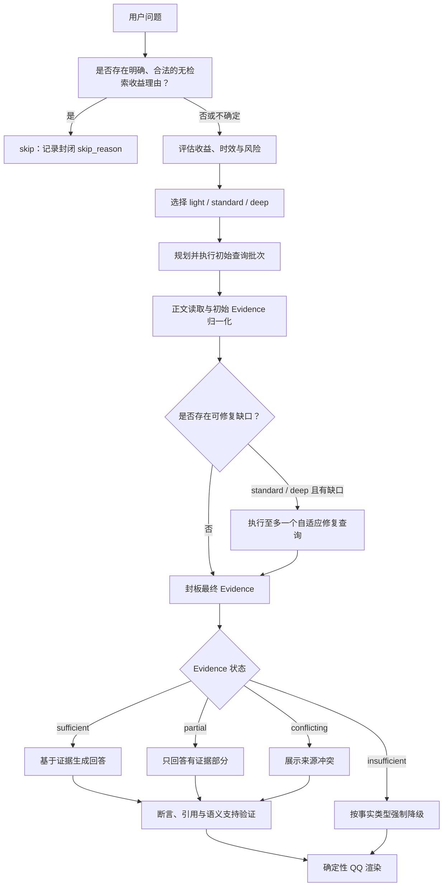

# qqbot_lite 路线 B：检索收益路由与证据化搜索设计

**日期：** 2026-07-29
**状态：** 已按首轮复核修订并经用户确认；实施计划已生成，尚未修改生产代码
**适用范围：** 普通聊天、显式 `/search`、模型补充检索、搜索失败降级、引用与 QQ 输出
**设计路线：** 路线 B——供应商中立的结构化 Evidence 搜索管线

---

## 1. 设计结论

路线 B 的基础原则正式调整为：

> 事实型问题默认搜索；只有存在明确、可记录、可审计的“无检索收益”理由时，程序才允许跳过搜索。

搜索路由不再询问模型“是否知道答案”“是否有信心”“是否属于常识”，而是判断：

> 执行搜索是否可能提高回答的准确性、时效性、完整性、可验证性、消歧能力或风险控制能力？

只要任一维度存在合理收益，就执行搜索。若分类器、路由模型或规则之间存在歧义，也执行最低级别的轻量搜索。

该原则必须由程序状态机、封闭枚举、强制覆盖规则和验收测试共同保证，不能只写进系统提示词。

---

## 2. 背景与现状

当前实现已经具有可用的搜索基础：

- `src/services/search_service.py` 使用 Tavily，并在失败时回退到 DDGS；
- 搜索结果会尝试读取部分网页正文；
- 普通聊天向模型暴露 `search_web` 工具；
- 显式 `/search` 可以直接触发搜索；
- 搜索文本中约定模型使用 `[1]` 一类的来源编号。

但当前结构与本设计目标存在五项根本差距：

1. 普通聊天是否搜索主要由模型自行决定，程序没有“事实型问题默认搜索”的硬约束。
2. 当前提示词允许“记忆中有答案就不搜索”，这会让内部知识或记忆绕过外部核验。
3. 搜索结果最终被压成一段文本，缺少来源、正文片段、时间、查询、抓取状态和引用关系等结构化数据。
4. 引用主要依赖模型按提示生成，程序没有验证编号、URL、断言覆盖率和证据支持关系。
5. Tavily 固定使用 `basic` 搜索，供应商分数、发布日期等信息被丢弃，也没有轻量、标准、深度三级预算。

因此，本设计不是在现有提示词上增加一句“多搜索”，而是改变搜索的控制权、数据合同和失败状态机。

---

## 3. 目标

### 3.1 产品目标

- 事实型问题默认进入检索流程。
- 对稳定、低风险问题使用低成本的轻量搜索。
- 对依赖外部事实的解释、原因、对比、技术、产品和推荐问题使用标准搜索。
- 对新闻、当前状态、会影响个人行动或可能造成实际损害的高风险请求、争议和复杂问题使用深度搜索。
- 让答案中的重要事实可追溯到真实 URL 和具体证据片段。
- 搜索失败、证据不足和来源冲突时，输出行为可预测且不会伪造证据。
- 保持 QQ 文本输出易读，不要求用户理解内部检索过程。
- 保留更换或增加搜索供应商的能力，不把路由、证据和引用逻辑绑定到 Tavily。

### 3.2 工程目标

- 搜索是否执行由程序路由决定，模型只能提供结构化建议。
- 搜索强度由程序下限、风险规则和预算共同决定。
- `/search` 与普通聊天共用同一 Evidence 管线。
- 搜索提供者、正文读取、证据整理、回答生成、引用验证和 QQ 渲染分层。
- 所有路由、查询、搜索尝试、证据状态和降级原因可观测。
- 为离线单元测试、录制响应测试和受控在线评测提供稳定接口。

---

## 4. 非目标

本阶段不承诺：

- 通过搜索彻底消除模型幻觉；搜索本身不能替代证据验证。
- 立即切换到 OpenAI、Brave、Exa 或 Gemini 原生搜索。
- 为所有网页引入浏览器自动化或完整 JavaScript 渲染。
- 建立通用向量数据库或长期保存网页全文。
- 把用户的私有记忆、群聊历史或身份信息自动发送给搜索提供者。
- 用单一“来源质量分”自动裁决争议事实。
- 在本设计文档通过复核前直接修改生产代码。

---

## 5. 核心术语

### 5.1 检索收益

检索收益由六个互不替代的维度组成：

| 维度 | 含义 | 典型例子 |
|---|---|---|
| `accuracy` | 核对事实是否正确 | 专有名词含义、游戏机制 |
| `freshness` | 获取当前或特定日期状态 | 最新版本、价格、新闻 |
| `completeness` | 补足多方面信息 | A 与 B 的完整对比 |
| `verifiability` | 提供可访问的真实来源 | 用户要求引用或查证 |
| `disambiguation` | 区分同名实体或模糊表达 | 冷门人物、缩写、网络梗 |
| `risk_control` | 降低会影响个人行动或造成实际损害的错误 | 个体诊疗、责任判断、投资操作、安全处置 |

任一维度可能受益，即满足搜索条件。路由不要求收益“很高”。

### 5.2 搜索路由、编排、提供者尝试与成功

四个阶段必须分开统计：

- **搜索路由：** 最终路由为 `light`、`standard` 或 `deep`。
- **编排器启动：** 搜索编排器实际开始处理 SearchPlan；即使没有可用 provider，也必须留下启动和失败记录。
- **提供者尝试：** 至少一个已配置 provider 适配器实际收到调用；超时、无结果和调用后不可用仍算尝试，但不算成功。
- **搜索成功：** 获得足够支持回答的有效 Evidence。

提供者未配置、超时、无结果或正文读取失败可以导致管线停在不同阶段，但都不能被统计成“无需搜索”或改写为 `skip`。

生产启动检查必须确认至少有一个可用搜索提供者。若检查失败，机器人可以继续处理明确无检索收益的任务，但事实型请求必须进入 `provider_not_configured` 降级，不能静默按普通聊天处理。

### 5.3 重要事实断言

会实质影响答案结论的外部事实，包括但不限于：

- 人物、组织、产品、版本、价格、日期、数量和状态；
- 原因、比较、评价或推荐所依赖的事实；
- 新闻、政策、规则、服务状态和个体化高后果建议；
- 用户明确要求核实或引用的内容。

寒暄、过渡语、明确标注的主观建议以及纯逻辑推导不属于外部事实断言。

---

## 6. 不可违反的程序级不变量

以下规则必须落实为代码断言和测试，而不是依赖提示词：

1. 用户明确要求搜索、核实、查证或提供来源时，最终路由不得为 `skip`。
2. 用户明确要求不要联网时，程序不得调用搜索提供者。
3. `skip` 必须携带封闭枚举中的 `skip_reason`；自由文本理由无效。
4. 没有合法 `skip_reason`、分类失败、模型输出无效或规则冲突时，默认执行轻量搜索。
5. “模型知道”“模型有信心”“属于常识”“训练数据中应当有”“不搜索也能回答”不属于合法 `skip_reason`。
6. 内部记忆命中不属于合法 `skip_reason`。
7. 模型给出的搜索级别只能提高程序级别，不能降低程序确定的最低级别。
8. 动态事实在没有有效 Evidence 时不得输出确定结论。
9. 涉及个人行动、具体风险或潜在实际损害的高风险事实，在 Evidence 不足时不得使用模型记忆补成确定答案。
10. 所有展示给用户的引用必须映射到本次请求实际获得的 Evidence 和真实 URL。
11. 搜索失败时，程序必须选择明确的降级状态，不能无痕回到普通模型回答。
12. 来源存在未解决冲突时，答案必须展示冲突，不能静默合并成单一结论。
13. 搜索成功后，模型不得以自身记忆、训练知识或主观判断推翻有效 Evidence。模型内部知识不能作为未记录、不可见的隐藏反证；只有 Evidence 之间的差异才能进入正式冲突处理。
14. 一个初始查询批次无论包含多少个并行查询，都只算一个初始检索轮次；`standard` 和 `deep` 最多再执行一个自适应修复查询，总检索轮次不得超过两个，回答验证后不得继续补搜。
15. 查询相关性是进入可引用 Evidence 的前置门槛；第一方、官方或原始来源身份不能让不相关内容越过该门槛。

---

## 7. 路由输出模型

最终路由只有四种：

```text
skip
light
standard
deep
```

跳过搜索只允许以下封闭理由：

```text
user_forbid_web
social_or_emotional
creative_or_roleplay
provided_text_transform
provided_content_summary
pure_math
closed_logic
closed_context_only
```

各理由含义如下：

| `skip_reason` | 允许条件 |
|---|---|
| `user_forbid_web` | 用户明确要求不联网、不搜索或只依据给定材料 |
| `social_or_emotional` | 纯闲聊、陪伴或情绪交流，不含需要核实的外部事实 |
| `creative_or_roleplay` | 纯创作或角色扮演，不要求真实、准确或特定事实背景 |
| `provided_text_transform` | 只翻译、润色、改写用户已提供文本 |
| `provided_content_summary` | 只总结用户已提供内容 |
| `pure_math` | 只需数学计算或形式推导，不依赖外部常数或事实 |
| `closed_logic` | 前提全部由用户给定的纯逻辑分析 |
| `closed_context_only` | 只询问当前对话、用户材料或机器人内部可见状态 |

如果一个任务同时包含上述任务和外部事实要求，它是混合任务，不能使用这些理由跳过搜索。例如：

- “润色这段关于 GPT 最新价格的介绍，并顺便检查价格”必须搜索；
- “按唐代真实制度写一段故事”必须搜索；
- “总结我给的报告，并核实其中三项统计数据”必须搜索；
- “根据我们刚才定下的名称再列一次”可以使用 `closed_context_only`。

---

## 8. Retrieval Benefit Router

### 8.1 路由职责

`RetrievalBenefitRouter` 只回答三个问题：

1. 是否有足够明确的理由跳过搜索？
2. 如果不能跳过，程序要求的最低搜索级别是什么？
3. 哪些检索收益维度、时效或风险触发了该决定？

它不判断模型是否已经知道答案。

### 8.2 决策顺序

程序按以下固定顺序决策：

```text
1. 检测用户是否明确禁止联网
2. 检测用户是否明确要求搜索、核实、来源或最新信息
3. 检测动态事实、个人行动与实际损害风险、争议和复杂度触发器
4. 检测是否完整匹配封闭的无收益任务
5. 对其余事实型或混合任务默认搜索
6. 选择程序最低级别
7. 接收模型的收益分析、查询规划和升级建议
8. 校验模型输出并取不低于程序下限的最终级别
```

优先级规则：

- “禁止联网”高于“默认搜索”，因为这是用户明确约束；
- 如果用户同时说“请联网搜索”与“不要联网”，请求存在冲突，机器人应先指出冲突并请求澄清，不执行搜索；
- 除上述冲突外，显式搜索要求覆盖任何跳过候选；
- 动态事实、个体化行动建议、当前规则或潜在实际损害触发器可以把 `light` 或 `standard` 提升为 `deep`；
- 无法可靠分类时使用 `light`，不能使用 `skip`。

### 8.3 模型参与边界

模型可以输出：

- 可能受益的六个检索维度；
- 任务类型和外部事实需求；
- 实体、时间范围、行动性、潜在损害和歧义点；
- `light`、`standard`、`deep` 的建议；
- 查询拆分方案；
- 初次结果后是否存在证据缺口或冲突；
- 一次补搜的目标。

模型不可以：

- 以自身知识、自信或“常识”为由选择 `skip`；
- 降低程序确定的最低搜索级别；
- 把内部记忆当作外部来源；
- 在搜索失败后自行解除降级限制；
- 创建不存在于 Evidence 中的引用。

路由模型只能提交 `skip_candidate`。程序仅在其理由属于封闭枚举、没有外部事实目标、没有强制搜索触发器且请求完整匹配对应任务时接受。任何字段缺失、结构错误或歧义都回退到 `light`。

### 8.4 路由数据合同

`TriggerCode` 同样使用封闭枚举：

```text
explicit_no_web
explicit_search
explicit_verification
explicit_source_request
freshness_marker
dynamic_attribute
regulated_domain_foundation
high_consequence_action
current_rule_or_policy
controversy_or_conflict
external_fact_explanation_or_comparison
recommendation_or_evaluation
ambiguous_entity
multi_hop_complexity
mixed_task
factual_default
classifier_uncertain
```

其中 `explicit_no_web` 只触发受约束的 `skip` 或冲突澄清；`explicit_search`、`explicit_verification` 和 `explicit_source_request` 强制搜索；其余代码用于确定最低级别和记录原因。`external_fact_explanation_or_comparison` 只有在回答依赖外部事实时才成立，不能由“为什么”“解释”“区别”等词语单独触发。实现不得接受模型临时创造的新触发代码。

```python
RetrievalDecision(
    route,                    # skip | light | standard | deep
    skip_reason,              # SkipReason | None
    forced_search,            # bool
    trigger_codes,            # list[TriggerCode]
    benefit_dimensions,       # set[BenefitDimension]
    factuality,               # non_factual | factual | mixed | ambiguous
    external_fact_required,   # bool
    freshness,                # none | low | high
    risk,                     # low | medium | high
    actionability,            # none | general | personalized
    potential_harm,           # none | low | high
    program_minimum_tier,     # light | standard | deep | None
    model_recommended_tier,   # light | standard | deep | None
    final_reason_codes,       # list[TriggerCode]
)
```

该结构只保存可审计的代码和枚举，不把模型的长篇推理写入日志。

### 8.5 高风险级别按请求后果判定

医疗、法律、金融、安全只是风险领域线索，不是自动进入 `deep` 的充分条件。程序必须结合请求是否个体化、是否指导行动、是否依赖当前规则以及错误是否可能造成实际损害来确定最低级别：

- 只解释稳定基础概念，且不涉及个人行动、具体风险或当前规则：最低 `standard`；
- 涉及个人症状、剂量、诊断、责任判断、具体法律结论、投资操作、安全处置或其他高后果行动：必须 `deep`；
- 涉及当前法规、实时政策、市场状态或会快速变化的风险信息：必须 `deep`；
- 分类器只识别到领域关键词、但无法判断请求后果时，不得直接使用 `deep`；应结合完整请求判断，仍不明确时至少 `standard`，并允许模型建议升级。

示例：

| 请求 | 程序最低级别 | 原因 |
|---|---|---|
| “什么是股票” | `standard` | 稳定的金融基础概念 |
| “我现在是否应该买这只股票” | `deep` | 个体化投资行动和当前市场状态 |
| “什么是民法” | `standard` | 稳定的法律基础概念 |
| “我的具体情况是否违法” | `deep` | 个体化责任判断和现实后果 |

### 8.6 解释与比较触发器按事实依赖判定

解释或比较只有在依赖外部事实、现实机制、技术规范、具体实体或其他可核查信息时，才触发 `external_fact_explanation_or_comparison` 并将最低级别设为 `standard`。程序不得只匹配疑问词。

以下任务不因此触发标准搜索：

- 解释用户已经提供的文字；
- 解释当前对话中的内容；
- 纯数学证明；
- 全部前提由用户提供的逻辑分析；
- 只分析用户自己的想法、措辞或表达方式。

这些任务应根据完整请求使用 `provided_content_summary`、`provided_text_transform`、`pure_math`、`closed_logic` 或 `closed_context_only`；如果同时要求核查外部事实，则仍按混合事实任务搜索。

---

## 9. 搜索强度分级

### 9.1 轻量搜索

适用：

- 普通、稳定、低风险的事实问题；
- 简单定义、人物或作品基础信息；
- 即使模型可能知道，但低成本核对可改善准确性或引用的问题。

预算和行为：

- 最多 1 个语义查询；
- 主提供者最多返回 5 个候选结果；
- 最多读取 2 个正文或提供者原生内容片段；
- 先以查询相关性作为进入 Evidence 的前置门槛；在直接回答当前问题的候选中，再优先第一方、原始来源或可靠独立来源；
- 主提供者失败时允许同一查询调用一个回退提供者；
- 不进行补搜修复；
- 无明显冲突且关键事实有支持时直接生成带引用回答。

### 9.2 标准搜索

适用：

- 依赖外部事实、现实机制或可核查信息的解释、原因和背景分析；
- 依赖外部事实或具体实体的 A 与 B 区别或对比；
- 技术、软件、产品、公司、游戏机制；
- 推荐、评价、冷门实体和需要消歧的问题；
- 医疗、法律、金融、安全领域中不涉及个人行动、具体风险或当前规则的稳定基础概念；
- 用户明确要求核实或提供来源，但不属于高时效或个体化高后果请求。

预算和行为：

- 第一阶段最多规划 3 个不同目的的初始查询；这些查询可以并行执行，整体只算一个初始检索轮次；
- 查询通常覆盖直接答案、第一方来源和独立核验；
- 最多保留 8 个去重候选 URL；
- 最多读取 5 个相关正文片段；
- 检查重要事实是否有直接 Evidence；
- 初始 Evidence 整理和缺口分析后，证据部分缺失或发生冲突时，第二阶段最多执行 1 个自适应定向修复查询；
- 包含修复在内，语义查询总数最多 4 个。

### 9.3 深度搜索

适用：

- 新闻、最近、目前、今天、最新和当前状态；
- 版本、价格、额度、规则、政策和服务状态等动态事实；
- 涉及个人决策、症状、剂量、诊断、责任判断、投资操作、安全处置或可能造成实际损害的问题；
- 当前法规、实时政策和其他需要最新风险信息的问题；
- 争议事实、来源冲突、多跳问题和复杂研究型请求。

预算和行为：

- 第一阶段最多规划 5 个不同目的的初始查询；这些查询可以并行执行，整体只算一个初始检索轮次；
- 查询包含明确日期、时间窗口或版本限制；
- 同时寻找第一方来源和独立来源；
- 最多保留 15 个去重候选 URL；
- 最多读取 8 个相关正文片段；
- 对每项重要结论建立断言与 Evidence 映射；
- 检测来源冲突、发布日期和是否已经被后续内容更新；
- 初始 Evidence 整理和缺口分析后，证据不足时第二阶段最多执行 1 个自适应定向修复查询；
- 包含修复在内，语义查询总数最多 6 个。

### 9.4 程序最低级别

| 请求特征 | 最低级别 |
|---|---|
| 稳定、简单、低风险事实 | `light` |
| 依赖外部事实的解释、原因、对比、技术、产品、推荐、消歧 | `standard` |
| 医疗、法律、金融、安全领域的稳定基础概念，不涉及个人行动或当前规则 | `standard` |
| 明确要求核实或真实来源 | `standard` |
| 新闻、当前状态、最新、价格、版本、规则、政策 | `deep` |
| 个体化症状、剂量、责任、投资或安全行动，以及可能造成实际损害的高后果请求 | `deep` |
| 当前法规、实时政策或动态风险信息 | `deep` |
| 争议、多跳、复杂且需多来源 | `deep` |
| 分类失败或事实性存在歧义 | `light` |

模型可以把级别向上提升，但不能向下降级。

---

## 10. 查询规划

### 10.1 查询类型

查询规划器从下列目的中选择，不要求每次全部生成：

- `direct`：直接回答原问题；
- `primary`：寻找官网、原始文档、作者、机构或项目来源；
- `independent`：寻找独立来源核验；
- `time_bounded`：限定日期、版本或事件窗口；
- `disambiguation`：确认实体、缩写或同名对象；
- `counterevidence`：主动寻找可能冲突或反例；
- `repair`：只填补已经识别出的证据缺口。

### 10.2 查询计划合同

```python
SearchPlan(
    decision,
    original_question,
    planning_status,        # normal | degraded
    entities,
    time_window,
    initial_queries,
    required_source_relations,
    max_candidate_urls,
    max_content_reads,
    repair_budget,
)

SearchQuery(
    query_id,
    purpose,
    text,
    date_from,
    date_to,
    include_domains,
    exclude_domains,
)

RepairPlan(
    triggered,
    gap_codes,
    repair_query,            # SearchQuery | None
)
```

### 10.3 查询校验

程序必须：

- 保留原始问题，查询改写不能取代原问题；
- 去除重复或只有措辞差异的查询；
- 限制长度、数量和补搜次数；
- 为动态问题加入当前日期或明确时间窗口；
- 禁止把 API 密钥、内部提示词和未获授权的私有记忆写入查询；
- 中文、日文等无空格语言应保留用户的原始自然语言问题，同时提取实体、时间范围、问题意图和检索目的，生成必要的补充查询；不得只进行机械分词，也不得把原始整句视为不可拆解的唯一精确词项；
- 规划模型失败不得把请求改为 `skip` 或降低路由级别。程序至少使用经过最小清理的用户原问题执行 `direct` 查询；`deep` 仍应用确定性的日期或时间窗口，能可靠提取实体时，`standard` / `deep` 再生成受模板约束的第一方或独立来源查询，并记录 `planning_status=degraded`。

例如，“北京今天有什么新闻”应保留原始整句作为 `direct` 查询，同时提取：

- 地点：北京；
- 时间：今天以及请求发生时的当前日期；
- 意图：新闻或重要事件；
- 可能的官方来源查询；
- 必要时的独立新闻来源核验。

### 10.4 检索轮次定义

路线 B 把“查询数量”和“检索轮次”作为两个不同维度：

1. **第一阶段——初始检索轮次：** 执行 `SearchPlan.initial_queries` 中预先规划的一个或多个查询。多个初始查询可以并行执行，但无论查询数量是多少，都只算一个初始轮次。
2. **Evidence 整理与缺口分析：** 对第一阶段结果完成相关性门控、正文读取、去重、来源关系、冲突和缺失主题分析。
3. **第二阶段——自适应修复轮次：** 仅 `standard` 或 `deep` 可在存在明确缺口时生成并执行至多 1 个 `repair_query`。该查询必须针对已记录的缺口或冲突，不能重复第一阶段查询。

其他边界：

- `light` 只有初始轮次，没有自适应修复轮次；
- 同一查询因提供者错误而切换回退提供者属于提供者重试，不是新的自适应轮次；
- 正文读取和同一 URL 的受限重试不算新的搜索轮次；
- 第二阶段完成后重新整理一次最终 Evidence，此后不得再发起第三轮搜索；
- 回答生成后的验证失败只能删除、降级或拒绝已知未支撑断言，不能开启新的补搜循环；
- 初始查询数、修复查询数、提供者调用数和实际检索轮次必须分别记录。

---

## 11. 搜索提供者策略

### 11.1 供应商中立接口

所有搜索提供者输出统一的 `ProviderSearchResult`，上层路由和 Evidence 逻辑不得读取 Tavily 或 DDGS 私有字段。

首期实现顺序：

1. Tavily 作为主提供者；
2. DDGS 作为可用性回退，但其结果不得自动视为与第一方正文等价；
3. Brave LLM Context、Exa 或 OpenAI 托管搜索仅通过独立适配器加入后续 A/B 评测。

### 11.2 Tavily 使用方式

- 轻量搜索使用低延迟模式；
- 标准和深度搜索使用更完整的搜索深度；
- 保留提供者分数、发布日期、原始内容或相关片段；
- 使用时间、主题、包含域和排除域能力；
- 供应商自动参数不得突破本地的查询数、域名和时间预算。

### 11.3 原生模型搜索暂不作为首期主路径

OpenAI、Gemini 等原生搜索可以减少自建编排，但会带来供应商绑定、费用、输出协议和展示条款差异。特别是 Gemini Grounding 对 Grounded Results 和 Search Suggestions 有展示要求，未验证 QQ 纯文本呈现是否完全合规前，不作为首期默认路径。

路线 B 先建立统一 Evidence 合同。以后接入原生搜索时，也必须转换成同一 Evidence、断言和引用结构，不能绕过本地失败策略。

---

## 12. 正文读取与内容处理

搜索结果页只提供候选来源，不等于已经获得可引用证据。

正文读取层需要：

- URL 规范化、重定向处理和同源去重；
- 保留最终 URL、发布日期、抓取时间和内容类型；
- 对 HTML 提取与查询相关的段落，不只截取页面开头；
- 支持文本型 PDF 的受限提取；
- 优先使用搜索提供者返回的相关正文片段或原始内容；
- 对无法渲染的 JavaScript 页面记录 `extraction_failed`，不伪造正文；
- 保留现有 SSRF、防内网地址、响应大小和超时限制；
- 把网页内容视为不可信数据，忽略其中要求模型改变规则或调用工具的提示。

正文读取失败不等于搜索完全失败。若提供者片段直接支持某项低风险事实，可将其标记为 `provider_snippet` Evidence；动态或个体化高后果断言不得只依赖标题，且应尽量读取来源正文。

---

## 13. 结构化 Evidence

### 13.1 EvidenceItem

```python
EvidenceItem(
    evidence_id,
    query_id,
    provider,
    title,
    url,
    canonical_url,
    domain,
    publisher,
    source_relation,       # primary | independent | secondary | community | unknown
    published_at,
    retrieved_at,
    excerpt,
    excerpt_origin,        # provider_snippet | page_extract | document_extract
    extraction_status,
    provider_score,
    relevance_score,
    relevance_gate_passed,
    freshness_state,
    citable,
    safety_flags,
)
```

`source_relation` 必须相对于当前问题判断。例如，某个开发者博客对其本人项目可以是第一方，对另一个公司的产品则不是。不能仅因域名包含 `docs`、`developer` 或 URL 包含 `/docs` 就自动判为官方来源。

Evidence 准入和排序采用固定顺序：

1. 先判断候选内容是否直接回答当前问题或支持待验证断言；
2. 未通过查询相关性门槛的候选不得进入可引用 Evidence；
3. 只在通过相关性门槛的候选之间，再使用第一方、原始来源、独立性、时效性和内容完整度排序；
4. 第一方页面若只有一般介绍、没有支持具体断言，不得因“官方”身份获得高优先级，也不得用于该断言的引用；
5. `docs`、`developer`、`official` 等域名片段或 `/docs` 路径只能作为待核实线索，不能证明它属于当前实体或直接支持问题。

来源关系不能补救不相关性：一个高度相关的可靠独立来源应排在不直接回答问题的官网页面之前。

程序可以确定性地保证只有 `relevance_gate_passed=True` 的条目进入可引用 Evidence；但相关性判断本身可能包含模型或启发式分类，其正确性必须使用人工标注候选来源集评测，不能把结构门控通过率等同于语义相关性准确率。

### 13.2 EvidenceBundle

```python
EvidenceBundle(
    request_id,
    decision,
    plan,
    attempts,
    initial_evidence_ids,
    gap_analysis,
    repair_plan,
    retrieval_round_count,
    evidence_items,
    evidence_state,        # sufficient | partial | conflicting | insufficient
    missing_claim_topics,
    conflict_groups,
)

EvidenceGapAnalysis(
    missing_claim_topics,
    conflict_groups,
    weak_source_topics,
    repairable,
    repair_reason_codes,
)
```

Evidence 进入回答模型前必须完成：

- URL 去重和规范化；
- 查询相关性前置门控；
- 来源关系标注；
- 发布日期和抓取日期区分；
- 同一来源转载内容的独立性去重；
- 冲突分组；
- 可引用状态判定。

### 13.3 证据充分性

证据状态不用单一分数假装精确，而使用离散状态：

- `sufficient`：重要事实均有直接、相关且可引用的支持；
- `partial`：只能支持问题的一部分；
- `conflicting`：重要来源之间存在未解决冲突；
- `insufficient`：没有足以支撑重要结论的 Evidence。

深度搜索的重要动态或高后果结论原则上需要通过相关性门槛的第一方来源与至少一个独立域核验。若现实中只有单一权威来源，允许回答，但必须明确说明证据来源单一。

---

## 14. 新数据流

正式数据流为：

```text
用户问题
→ 请求规范化与显式约束识别
→ 判断是否存在明确无检索收益理由
→ 若不存在则默认进入搜索
→ 评估检索收益、时效性和风险
→ 选择 light / standard / deep
→ 生成并校验初始 SearchPlan
→ 第一阶段执行一个或多个预先规划的初始查询
→ 正文或相关片段读取
→ 归一化、去重并形成初始 EvidenceBundle
→ Evidence 缺口与冲突分析
→ standard / deep 必要时执行至多一个自适应修复查询
→ 重新整理并封板最终 EvidenceBundle
→ 判断 sufficient / partial / conflicting / insufficient
→ 基于 Evidence 生成结构化断言
→ 引用存在性、覆盖率和支持关系验证
→ 应用失败或冲突降级策略
→ QQ 文本渲染与消息分段
```



### 14.1 与当前工具调用方式的差异

当前方式是：

```text
模型先回答或自行决定调用 search_web
```

新方式是：

```text
程序先路由并在需要时完成初始搜索
模型再基于 Evidence 回答
```

普通事实请求不再依赖模型主动发起第一次 `search_web`。现有 `search_web` 工具可以在迁移期保留为兼容接口；最终只允许在标准或深度搜索的 Evidence 缺口分析后作为受预算控制的 `search_more` 能力，对应唯一一次自适应修复查询。它不能承担初始路由、不能重复已经完成的查询，也不能在回答验证后再次调用。

### 14.2 `/search` 行为

`/search`：

- 永远设置 `forced_search=True`；
- 简单稳定问题可以是 `light`；
- “核实、来源”以及依赖外部事实的对比或解释最低为 `standard`；
- 当前信息、个体化高后果行动或复杂问题最低为 `deep`；
- 与普通聊天共用 SearchPlan、Evidence、验证和降级逻辑；
- 搜索失败时明确报告失败，不能转成无声明的普通聊天回答。

---

## 15. 内部记忆与外部搜索的关系

现有“记忆命中就不要调用 `search_web`”规则必须移除。

新规则：

- 记忆可以提供人物偏好、对话延续和用户已说明的上下文；
- 记忆不是外部事实来源，不能满足新闻、当前状态、版本、价格、规则或个体化高后果事实的证据要求；
- 记忆命中不能降低搜索级别，也不能解除搜索失败后的降级；
- 搜索完成后，有效 Evidence 对外部事实具有优先权；模型不得因为内部记忆、训练知识或主观判断不一致而改写、否定或隐藏 Evidence 支持的结论；
- 模型内部知识与 Evidence 不一致时，不形成正式冲突，也不能作为隐藏反证。模型可以在尚有修复预算时建议检索外部反证，但只有实际取得的 Evidence 才能参与冲突处理；
- 只有 Evidence 项之间存在不一致时，才创建 `conflict_group` 并按来源冲突流程展示；
- 如果用户问的是“我之前说了什么”或只要求处理既有对话内容，可使用 `closed_context_only` 跳过搜索；
- 默认禁止把只存在于内部记忆中的私密内容加入搜索查询；
- 只有用户在当前消息中主动提供，或明确授权用于搜索的内容，才可以进入外部查询；
- 最终回答不得把记忆伪装成网页引用。

---

## 16. 基于证据生成回答

回答生成器接收 `EvidenceBundle`，而不是一段已经拼好的“搜索结果文本”。

模型应先形成结构化输出：

```python
GroundedReply(
    answer_blocks,
    claims,
    limitations,
    conflict_summary,
    used_knowledge_fallback,
)

Claim(
    claim_id,
    text,
    material,
    evidence_ids,
)

AnswerBlock(
    text,
    block_kind,             # factual | inference | non_factual
    claim_ids,
)
```

生成规则：

- 事实型回答采用低随机性的生成设置；
- 重要事实断言必须列出 `evidence_ids`；
- `factual` 段落必须引用一个或多个 `claim_ids`，不能在未标注的自由文本中夹带事实；
- 没有 Evidence 的内容只能是明确标注的推理、建议或允许的稳定知识降级；
- Evidence 充分时，事实内容以当前可验证 Evidence 为依据；模型记忆、训练知识或主观判断不能覆盖、推翻或静默修正 Evidence；
- 若有效 Evidence 之间冲突，必须保留冲突结构并展示；若只有模型内部知识不一致，则不能创建冲突结论或把内部知识写成无来源反证；
- 模型不能直接生成最终编号和 URL；
- 模型可以在 `answer_blocks` 中使用角色语气，但完整草稿必须随后通过事实与引用验证；
- 验证通过后只允许确定性的编号、来源列表、固定披露和 QQ 分段渲染，不再调用模型改写正文；
- 证据中没有的信息不能通过“合理推断”写成确定事实；
- 对推断必须使用“根据这些来源推测”等明确措辞，并引用推断所依据的 Evidence。

---

## 17. 引用与事实支撑验证

验证分为确定性结构检查、模型辅助断言发现、模型辅助语义支持判断和确定性失败处置。前者和处置策略可以要求系统行为 100% 符合；中间两个模型组件必须通过人工标注评测衡量，不能假设绝对正确。

### 17.1 确定性引用验证

程序检查：

- 每个 `evidence_id` 实际存在；
- 每个已声明 `Claim` 的引用映射都指向本次请求的 Evidence；
- Evidence 标记为 `citable`；
- URL 来自本次搜索结果或经过验证的最终重定向；
- 引用编号连续且与来源列表一致；
- 不存在无引用对象的 `[n]`；
- 不存在未被答案使用却展示的装饰性来源；
- 搜索失败或不存在有效 Evidence 时不展示来源列表；
- 动态事实处于 `insufficient` 时只能进入固定降级模板，不能进入确定结论渲染路径；
- 用户明确禁止联网时没有任何 provider 调用记录。

### 17.2 模型辅助断言发现

独立的断言发现器扫描完整回答草稿，输出候选事实文本跨度、重要性和对应 `Claim`。它用于发现生成模型漏报的事实，但它本身仍是概率模型：

- 不能只信任生成模型自行提交的 `claims` 列表；
- 发现器标记但没有映射到 `Claim` 的事实跨度视为已知未覆盖；
- 发现器质量必须在人工作为真值的评测集上报告精确率、召回率和 F1；
- 不能用发现器自己的置信度或自报结果证明“全部重要事实均已识别”。

### 17.3 语义支持验证

受限的验证模型只判断：

- Evidence 是否直接支持对应断言；
- Evidence 是否只支持其中一部分；
- Evidence 是否与断言冲突；
- 断言是否夸大了来源。

语义验证器不能增加新事实，其精确率、召回率和 F1 同样必须在人工标注的“支持、部分支持、冲突、不支持”样例上计算。动态和个体化高后果问题使用更高的评测门槛，但不得仅凭验证模型自报达到 100%。

### 17.4 已知验证失败的系统处置

程序对已经发现的问题执行确定性策略：

- 结构校验失败的引用不得进入最终答案；
- 断言发现器标记为未映射的事实跨度必须删除、改为明确推断或进入降级；
- 语义验证器判定为部分支持、冲突或不支持的断言不得按完整确定事实保留；
- `partial` 状态下，答案不得覆盖已记录的 `missing_claim_topics`；
- `conflicting` 状态下，答案必须包含 Evidence 之间的冲突说明；
- 回答生成后的验证失败不再触发搜索；若前置 Evidence 缺口阶段没有解决问题，最终只能删减、降级或拒绝；
- 最终答案不允许保留系统已经知道未受支持的断言。

---

## 18. 搜索失败与降级状态机

### 18.1 失败类型

```text
provider_not_configured
provider_unavailable
provider_timeout
no_results
content_unreadable
insufficient_evidence
partial_evidence
source_conflict
validation_failed
user_forbid_web
```

### 18.2 强制行为矩阵

| 场景 | 允许行为 | 禁止行为 |
|---|---|---|
| 动态事实搜索失败 | 明确说明无法在线核验，不给确定结论；可说明需要查看的官方位置 | 依赖模型记忆给出当前价格、状态、版本或新闻结论 |
| 个体化或高后果风险问题搜索失败 | 给一般性安全提示、建议咨询合格专业人士，或拒绝具体事实结论 | 用内部知识补成确定医疗、法律、金融或安全行动建议 |
| 稳定知识或风险领域基础概念搜索失败 | 允许有限回答，但由程序固定添加“未完成在线核验，可能过时”的提示 | 无声明地切回普通回答；添加引用 |
| 部分证据成功 | 只回答 Evidence 支持的部分，并说明未核实部分 | 补全缺失部分或假装完整 |
| Evidence 来源冲突 | 展示各来源观点、日期和冲突点；若后续来源声称更新，也明确说明更新关系 | 把模型内部知识作为隐藏反证；静默选择、平均或合并为单一事实 |
| 回答生成后的引用或语义验证失败 | 删除不支持断言或降级 | 再发起修复搜索；保留装饰性或虚假引用 |
| 用户禁止联网 | 在约束范围内基于给定材料或已有知识回答，并标明时效限制 | 调用任何搜索提供者 |

### 18.3 固定披露

稳定知识的模型知识降级必须由程序渲染固定提示，而不是要求模型自觉添加：

```text
在线检索未完成。以下仅按已有知识作有限说明，可能不完整或已经过时：
```

动态事实无法核验时使用：

```text
我暂时无法完成在线核验，因此不能确认当前结论。
```

没有有效 Evidence 时不输出“来源”列表。

---

## 19. QQ 文本渲染

最终输出由渲染器生成，而不是让回答模型手写来源格式。

基本格式：

```text
回答正文……[1]

来源：
[1] 来源标题
https://example.com/page
```

规则：

- 编号根据实际使用顺序生成；
- 同一 URL 只列一次；
- 轻量回答通常展示 1 至 3 个最相关来源；
- 标准和深度回答只展示实际支持正文的来源，不堆砌搜索结果；
- 消息需要分段时，引用编号不能被拆坏，来源列表放在最后一个分段；
- 若平台无法点击某类链接，仍显示完整 URL；
- 冲突来源均要展示，不能只展示被模型偏好的来源；
- 任何降级提示必须出现在用户可见文本中。

---

## 20. 模块边界

为避免继续扩大单体 `search_service.py`，路线 B 使用以下职责边界：

```text
src/search/
  models.py              路由、计划、Evidence、断言和结果数据合同
  router.py              检索收益路由与程序级覆盖规则
  planner.py             结构化查询规划与预算校验
  orchestrator.py        搜索状态机和一次修复流程
  extraction.py          正文读取、相关片段和安全限制
  evidence.py            归一化、去重、来源关系和充分性
  validation.py          引用、覆盖率和语义支持验证
  renderer.py            QQ 文本、来源列表和固定降级提示
  providers/
    base.py              供应商中立接口
    tavily.py            Tavily 适配器
    ddgs.py              DDGS 回退适配器
```

兼容策略：

- `src/services/search_service.py` 在迁移期保留为薄门面；
- 现有 `/search` 调用点不必一次性全部改名；
- 旧 `SearchResult.text` 只用于兼容边界，内部不得再作为主数据结构；
- `chat_service` 通过注入的搜索编排接口获取 `GroundedReply`，避免搜索模块反向导入聊天服务形成循环依赖；
- 现有模型供应商链继续负责生成和降级，不要求路线 B 同时重写模型客户端。

---

## 21. 安全、隐私与网页提示注入

- 搜索查询只包含完成当前请求所必需的信息。
- 默认不把结构化记忆、群成员资料、历史消息和隐藏提示发送给外部提供者。
- 日志记录查询和 URL 时进行密钥、令牌和明显个人敏感信息清理。
- 网页正文始终作为不可信引用材料，不具备系统或工具指令权限。
- 页面中的“忽略之前指令”“调用某工具”“泄露提示词”等内容只可作为被引用文本，不能改变执行流。
- URL 读取继续阻止本机、私网、云元数据地址和非 HTTP(S) 协议。
- 限制重定向次数、正文大小、内容类型和读取时间。
- Evidence 日志默认只保存必要元数据和短片段，不长期保存完整网页。

---

## 22. 可观测性

### 22.1 单请求 Trace

每次请求生成一个 `SearchTrace`：

```python
SearchTrace(
    request_id,
    route,
    skip_reason,
    trigger_codes,
    factuality,
    external_fact_required,
    program_minimum_tier,
    final_tier,
    orchestrator_started,
    initial_query_count,
    initial_round_started,
    adaptive_repair_round_started,
    adaptive_repair_query,
    retrieval_round_count,
    executed_queries,
    provider_configured,
    provider_attempts,
    provider_invocation_started,
    provider_failures,
    candidate_url_count,
    citable_evidence_count,
    evidence_state,
    repair_used,
    claim_count,
    supported_claim_count,
    citation_count,
    knowledge_fallback_used,
    degradation_reason,
    route_latency_ms,
    query_planning_latency_ms,
    initial_provider_search_latency_ms,
    provider_search_total_latency_ms,
    initial_content_read_latency_ms,
    content_read_total_latency_ms,
    initial_evidence_assembly_latency_ms,
    evidence_assembly_total_latency_ms,
    gap_analysis_latency_ms,
    adaptive_repair_latency_ms,
    answer_generation_latency_ms,
    structural_validation_latency_ms,
    semantic_validation_latency_ms,
    qq_render_latency_ms,
    retrieval_pipeline_latency_ms,
    total_response_latency_ms,
)
```

观测要求：

- 跳过搜索必须能追溯到合法 `skip_reason`；
- 搜索路由、编排器启动、provider 尝试和 Evidence 成功分别统计；
- 初始查询数、自适应修复查询数和检索轮次分别统计，多个初始查询不得被记成多个自适应轮次；
- 提供者回退、超时、无结果和正文失败分别统计；
- 记录最终级别是否高于程序下限；
- 不记录模型的隐藏思维链；
- 不在普通日志中保存完整网页或未经清理的私有查询。

并行查询和并行正文读取的耗时字段记录墙钟时间，而不是把并行子任务时长相加。

### 22.2 生产检索覆盖率口径

生产覆盖率使用定期分层抽样并经人工复核的请求集合计算，不能直接把线上路由模型自己的分类当作分母真值。

定义：

```text
D_factual =
人工标注为 factual 或 mixed
且搜索至少存在一项合理收益
且不属于用户明确禁止联网
且不属于合法、纯封闭的 skip 任务
```

至少分别报告以下四个比例，均以 `D_factual` 为分母：

```text
route_coverage =
进入 light / standard / deep 的请求数 / D_factual

orchestrator_start_rate =
搜索编排器实际启动的请求数 / D_factual

provider_attempt_rate =
至少一个 provider 适配器实际尝试调用的请求数 / D_factual

sufficient_evidence_rate =
最终获得 sufficient Evidence 的请求数 / D_factual
```

同时报告管线条件转化率 `orchestrator_started / routed_search`、`provider_attempted / orchestrator_started` 和 `sufficient / provider_attempted`，用于区分路由漏搜、编排故障、提供者故障和证据不足。

排除与单列规则：

- `user_forbid_web` 不进入 `D_factual`，单列其零 provider 调用率；
- `closed_context_only`、`provided_text_transform` 等合法纯封闭任务不进入 `D_factual`，按 `skip_reason` 单列；
- `provider_not_configured` 和 `provider_unavailable` 不得重新分类为 `skip`，也不能从路由覆盖率分母中删除；
- 未配置 provider 时，路由和编排器启动仍按实际状态统计，`provider_attempted=False`，并单列 `provider_not_configured` 配置错误率；
- provider 已调用但超时、不可用或无结果时，计为 provider 尝试成功发生、Evidence 成功失败；
- `partial`、`conflicting` 和 `insufficient` 分别报告，不能并入 `sufficient` 美化搜索成功率。

### 22.3 延迟计时边界

各计时器定义如下：

| 指标 | 包含范围 |
|---|---|
| `route_latency_ms` | 请求规范化完成后，到最终 `RetrievalDecision` 产生 |
| `query_planning_latency_ms` | 最终路由产生后，到初始 `SearchPlan` 校验完成 |
| `initial_provider_search_latency_ms` | 初始查询批次开始，到所有初始 provider 调用完成或超时 |
| `provider_search_total_latency_ms` | 初始阶段与自适应修复阶段中所有 provider 搜索阶段的墙钟时间总和 |
| `initial_content_read_latency_ms` | 第一阶段候选 URL 的正文读取墙钟时间，包含受限读取重试 |
| `content_read_total_latency_ms` | 初始阶段与自适应修复阶段的正文读取墙钟时间总和 |
| `initial_evidence_assembly_latency_ms` | 第一阶段结果的归一化、相关性门控、去重、来源关系、冲突和初始 Evidence 状态整理 |
| `evidence_assembly_total_latency_ms` | 初始与修复结果的 Evidence 整理墙钟时间总和 |
| `gap_analysis_latency_ms` | 初始 Evidence 封装后，到是否需要修复的决定产生 |
| `adaptive_repair_latency_ms` | 唯一修复查询的规划、provider 调用、正文读取及 Evidence 重新整理；未执行时为 0 |
| `answer_generation_latency_ms` | 最终 Evidence 封板后，到结构化回答草稿产生 |
| `structural_validation_latency_ms` | 确定性 Claim、Evidence、URL、引用和渲染前状态检查 |
| `semantic_validation_latency_ms` | 断言发现与语义支持模型验证 |
| `qq_render_latency_ms` | 确定性编号、来源列表、固定披露和消息分段 |
| `retrieval_pipeline_latency_ms` | 从初始查询规划开始，到最终 Evidence 封板的墙钟时间，包含初始 provider、正文、Evidence、缺口分析和实际执行的修复阶段 |
| `total_response_latency_ms` | 路由开始，到最终 QQ 消息完成渲染 |

`retrieval_pipeline_latency_ms` 不包含路由、回答生成、结构验证、语义验证或 QQ 渲染；这些阶段必须单独记录，并只在 `total_response_latency_ms` 中汇总。正文读取和修复不得从检索阶段漏掉。

`adaptive_repair_latency_ms` 与 provider、正文和 Evidence 的 total 字段有意重叠，用于观察完整第二阶段；因此不能把所有组件字段简单相加推导总耗时。`retrieval_pipeline_latency_ms` 和 `total_response_latency_ms` 均使用实际起止时间计算。

---

## 23. 测试策略

### 23.1 路由单元测试

表驱动覆盖：

- 日常闲聊、情绪交流；
- 创作、角色扮演；
- 翻译、润色、改写和给定内容总结；
- 纯数学和封闭逻辑；
- 稳定事实；
- 普通知识解释；
- 依赖外部事实的原因、对比、技术、产品和推荐；
- 只解释用户文本、当前对话、纯数学证明和封闭逻辑的“为什么/解释/区别”任务；
- 游戏、人物、作品、事件、网络梗和缩写；
- 版本、价格、新闻、政策和当前状态；
- 医疗、法律、金融和安全领域的稳定基础概念；
- 个体化症状、剂量、责任、投资和安全行动请求；
- 用户明确搜索、核实、来源、最新；
- 用户明确禁止联网；
- 混合任务和无法分类任务。

必须加入对抗用例：

- 路由模型声称“我知道答案”；
- 路由模型声称“置信度很高”；
- 路由模型声称“这是常识”；
- 记忆中存在相同事实；
- 搜索取得的有效 Evidence 与模型内部记忆不一致；
- 模型仅凭内部记忆声称 Evidence 存在冲突；
- 路由模型输出未知 `skip_reason`；
- 路由模型异常、超时或返回非法 JSON。

这些用例除真实无收益任务外，都必须进入搜索。

### 23.2 分级测试

- 稳定简单事实为 `light`；
- 依赖外部事实的解释、对比、技术和推荐为 `standard`；
- 风险领域稳定基础概念为 `standard`；
- 动态、个体化高后果、争议和复杂问题为 `deep`；
- “什么是股票”“什么是民法”为 `standard`，“我现在是否应该买这只股票”“我的具体情况是否违法”为 `deep`；
- 只出现医疗、法律、金融、安全或“为什么”“区别”等词语，不能单独触发 `deep` 或 `standard`；
- 模型不能把程序 `deep` 降为 `standard`；
- 模型允许把 `light` 升为 `standard`；
- 查询规划模型失败时保持原路由级别，执行确定性降级计划并记录 `planning_status=degraded`；
- 每级查询、URL、正文读取和修复预算不能越界；
- 标准或深度的多个并行初始查询只记为一个初始轮次；
- 标准或深度最多执行一个自适应修复查询，总检索轮次最多为两个；
- 轻量搜索没有自适应修复轮次；
- 回答生成后的验证失败不能触发第三轮搜索。

### 23.3 Evidence 与引用测试

- URL 规范化和重复来源合并；
- “域名包含 docs”不能单独判为第一方；
- 不相关的官网页面不能通过相关性门槛，直接相关的可靠独立来源可以进入 Evidence 并排在其前；
- 第一方身份不能补救不支持具体断言的页面；
- 发布日期与抓取日期不混淆；
- 中文、日文规划保留原始自然语言查询，同时提取实体、时间、意图和必要的补充查询；
- “北京今天有什么新闻”同时生成原始直接查询和带当前日期、官方或独立核验目的的结构化计划；
- 引用编号与 URL 一一对应；
- 不存在的 Evidence ID 被拒绝；
- 未被正文使用的来源不展示；
- 重要断言缺少支持时验证失败；
- 冲突来源被分组并展示；
- 模型内部知识与有效 Evidence 不一致时，回答仍以 Evidence 为依据且不创建虚假 `conflict_group`；
- 网页提示注入不能改变系统行为。

### 23.4 验证器与系统处置测试

确定性测试必须覆盖：

- 引用 ID、Evidence ID 和 URL 映射；
- 编号悬空、未使用来源和失败后引用；
- 动态事实无 Evidence 时进入固定降级；
- 已被任一验证器标记为不支持的断言不会出现在最终确定答案中。

人工标注评测分别衡量：

- 断言发现器对重要事实文本跨度的精确率、召回率和 F1；
- 语义验证器对“支持、部分支持、冲突、不支持”的精确率、召回率和 F1；
- 查询相关性门控对“直接相关、不相关”的精确率、召回率和 F1；
- 普通事实集合与动态、个体化高后果集合的分组指标；
- 不能使用验证模型自己的输出作为评测真值。

### 23.5 失败状态测试

对每个搜索级别模拟：

- 主提供者超时；
- 主提供者无结果；
- DDGS 回退失败；
- 搜索有结果但正文不可读；
- 只有部分事实有 Evidence；
- 来源直接冲突；
- 引用验证失败；
- 修复查询仍然失败。

动态、个体化高后果、风险领域稳定基础概念和普通稳定知识必须分别验证其固定降级文本与可回答范围。

### 23.6 评测集

首个版本建立至少 140 条人工标注样例：

- 20 条明确无检索收益任务；
- 20 条稳定事实与轻量搜索；
- 25 条解释、对比、技术和产品问题；
- 20 条新闻、当前状态和动态事实；
- 15 条风险领域或争议问题，明确区分稳定基础概念与个体化高后果行动；
- 10 条明确要求搜索、核实或来源；
- 10 条模糊实体或混合任务；
- 20 条搜索失败、部分证据、冲突和提示注入场景。

每条至少标注：

- 是否允许跳过；
- 合法 `skip_reason`；
- 最低搜索级别；
- 是否依赖外部事实；
- 行动性和潜在损害等级；
- 预期查询目的；
- 预期初始查询数和最大检索轮次；
- 关键断言；
- 可接受证据类型；
- 人工标注的断言跨度与语义支持标签；
- 预期失败或冲突行为。

在线评测与离线录制响应分开运行，避免把外部搜索波动误判为代码回归。

---

## 24. 验收标准

### 24.1 路由与执行

1. 在人工标注的强制检索集合中，路由进入搜索的比例为 **100%**。
2. 用户明确要求搜索、核实、查证或提供来源时，路由进入搜索和搜索编排器启动率均为 **100%**。至少一个 provider 已配置时，适配器实际调用尝试率为 **100%**；未配置时必须记录 `provider_not_configured` 并进入失败降级，不能改成 `skip`。
3. 按 22.2 节的 `D_factual` 口径，在抽样生产请求的人工复核中，`route_coverage` 不低于 **98%**；在固定评测集中，没有合法跳过理由的样例必须达到 **100%**。
4. `route_coverage`、`orchestrator_start_rate`、`provider_attempt_rate` 和 `sufficient_evidence_rate` 四项指标的 Trace 字段完整率为 **100%**，并分别展示，不得合并成单一“搜索率”。
5. `provider_not_configured`、`provider_unavailable`、超时和无结果分别报告；它们属于配置或执行失败，不得计为路由漏搜，也不得重新归类为 `skip`。
6. 因“模型知道”“模型有信心”“属于常识”“训练数据中应该有”而跳过搜索的次数为 **0**。
7. 记忆命中导致事实型问题绕过搜索的次数为 **0**。
8. 用户明确禁止联网时，外部搜索调用次数为 **0**。
9. 所有 `skip` 决定具有合法、可记录的封闭 `skip_reason`，覆盖率为 **100%**。

### 24.2 搜索分级

1. `light`、`standard`、`deep` 在人工评测集上的宏平均 F1 不低于 **0.90**。
2. 明确的动态或个体化高后果测试样例被错误降到较低级别的次数为 **0**；风险领域稳定基础概念被无条件提升为 `deep` 的次数为 **0**。
3. 各级查询数、候选 URL、正文读取数和修复次数的预算越界次数为 **0**。
4. 多个初始查询被误记为多个检索轮次的次数为 **0**；`standard` 和 `deep` 的自适应修复查询超过 1 个或总检索轮次超过 2 的次数为 **0**。
5. 仅因“为什么”“解释”“区别”或风险领域关键词而错误升级的次数为 **0**。
6. 查询规划模型失败后，路由被跳过或降级的次数为 **0**。
7. 在明确无检索收益的非事实评测集中，无意义搜索率不高于 **10%**。
8. “控制无意义搜索率”不得作为降低事实型默认检索覆盖率的理由，两项指标独立验收。

### 24.3 Evidence 与引用

确定性系统行为要求：

1. 每个引用 ID、已声明 Claim 的 Evidence ID 和最终 URL 映射均存在，结构检查通过率为 **100%**。
2. 引用编号悬空、搜索失败后附加引用、未被正文使用却展示来源的次数为 **0**。
3. 动态事实在没有有效 Evidence 时输出确定结论的次数为 **0**。
4. 用户明确禁止联网时调用 provider 的次数为 **0**。
5. 任一验证器已经标记为未映射、部分支持、冲突或不支持的断言，不得以完整确定事实保留在最终答案中；已知未支撑断言保留次数为 **0**。
6. 已记录的 Evidence 冲突未向用户展示的次数为 **0**；仅因模型内部知识不一致而创建冲突的次数为 **0**。
7. `partial` 状态下回答覆盖已知 `missing_claim_topics` 的次数为 **0**。
8. 未通过相关性门槛的来源进入可引用 Evidence 的次数为 **0**，第一方身份不得覆盖相关性门槛。

模型验证器质量要求，全部以人工标注真值计算：

1. 断言发现器对重要事实跨度的 precision、recall 和 F1 均不低于 **0.95**。
2. 语义支持验证器对“支持、部分支持、冲突、不支持”的宏平均 precision、recall 和 F1 均不低于 **0.95**。
3. 查询相关性门控在人工标注候选来源集上的 precision、recall 和 F1 均不低于 **0.95**。
4. 在动态和个体化高后果子集上，断言发现与语义支持的 precision、recall 和 F1 均不低于 **0.97**。
5. 不得使用生成模型或验证模型的自报标签替代人工评测真值，也不得把模型指标描述为绝对正确。

### 24.4 搜索失败

1. 搜索失败后未经声明直接使用模型记忆回答的次数为 **0**。
2. 稳定知识启用有限模型知识降级时，固定披露展示率为 **100%**。
3. 个体化高后果问题证据不足时，降级或拒答策略执行率为 **100%**。
4. 明确搜索请求失败时，向用户报告未完成检索的比例为 **100%**。
5. 唯一一次自适应修复仍失败后继续循环补搜，或回答验证后再次发起搜索的次数为 **0**。
6. 搜索成功后，模型记忆覆盖有效 Evidence 的次数为 **0**。

### 24.5 安全与隐私

1. 未经用户授权把私有记忆内容发送到搜索查询的次数为 **0**。
2. 网页提示注入改变路由、工具权限或失败策略的次数为 **0**。
3. SSRF、非 HTTP(S) 协议、私网地址和超限正文测试全部通过。

### 24.6 延迟与成本护栏

下表中的“搜索阶段”明确指 `retrieval_pipeline_latency_ms`：从查询规划开始，包含初始 provider 搜索、正文读取、Evidence 整理、缺口分析以及实际发生的唯一修复阶段；不包含路由、回答生成、结构验证、语义验证或 QQ 渲染。超过硬超时后进入既定失败状态。

| 级别 | `retrieval_pipeline_latency_ms` 目标 P95 | 硬超时 | 最大语义查询 | 最大检索轮次 |
|---|---:|---:|---:|---:|
| `light` | 6 秒 | 8 秒 | 1 | 1 |
| `standard` | 15 秒 | 20 秒 | 4（最多 3 个初始查询和 1 个修复查询） | 2 |
| `deep` | 30 秒 | 40 秒 | 6（最多 5 个初始查询和 1 个修复查询） | 2 |

路由、查询规划、provider、正文读取、Evidence、回答生成、结构验证、语义验证、修复和总响应耗时按 22.3 节分别输出 P50、P95 和 P99。`total_response_latency_ms` 是端到端指标，不能用“搜索阶段 P95”代替。

提供者可用性造成的失败不降低搜索路由率或编排器执行率；它计入提供者调用结果、Evidence 成功率、失败类型和延迟指标。

---

## 25. 迁移与发布顺序

本设计已通过复核，实施应按以下依赖关系推进：

1. 建立路由、计划、Evidence、断言和 Trace 数据合同；
2. 用评测集锁定“默认搜索、明确例外”的路由行为；
3. 将 Tavily 和 DDGS 迁移到供应商中立接口；
4. 实现三级查询预算、初始查询阶段、Evidence 缺口分析和唯一一次自适应修复阶段；
5. 接入基于 Evidence 的回答与确定性引用渲染；
6. 实现确定性引用检查、模型辅助断言发现、语义支持评测和已知失败处置；
7. 接入失败状态机、固定披露和冲突展示；
8. 将普通聊天从“模型决定首次搜索”切换为“程序先路由”；
9. 合并 `/search` 与普通聊天的数据流；
10. 在录制响应、受控在线搜索和 QQ 分段输出上完成验收。

切换期间必须保留回滚边界，但回滚只允许恢复旧版本程序，不得在新管线内部设置“默认不搜索”的静默开关。

---

## 26. 研究依据与供应商能力参考

- [ChatGPT Search 帮助文档](https://help.openai.com/en/articles/9237897-chatgpt-search)：查询改写、后续查询、行内引用和 Sources 面板。
- [OpenAI Web search API 指南](https://developers.openai.com/api/docs/guides/tools-web-search)：搜索、页面打开、页内查找、URL 引用标注和完整 sources。
- [OpenAI 关于事实准确性的说明](https://help.openai.com/en/articles/8313428)：即使使用搜索，模型仍可能出错或生成错误引用，因此必须验证。
- [Tavily Search API](https://docs.tavily.com/documentation/api-reference/endpoint/search)：搜索深度、时间范围、正文、域名和主题参数。
- [Brave LLM Context API](https://api-dashboard.search.brave.com/documentation/services/llm-context)：面向 LLM 的相关片段、令牌预算和来源元数据。
- [Exa Search API](https://exa.ai/docs/reference/search) 与 [Contents API](https://exa.ai/docs/reference/get-contents)：多种搜索模式、附加查询、日期限制、正文和高亮片段。
- [Gemini Grounding with Google Search](https://ai.google.dev/gemini-api/docs/generate-content/google-search) 与 [Gemini API 附加条款](https://ai.google.dev/gemini-api/terms)：结构化 grounding metadata 以及 Grounded Results/Search Suggestions 展示要求。
- [Anthropic Web Search Tool](https://platform.claude.com/docs/en/agents-and-tools/tool-use/web-search-tool)：重复搜索、域名控制、调用上限和引用的行业实现参考。
- [ALCE](https://arxiv.org/abs/2305.14627)、[RAGTruth](https://arxiv.org/abs/2401.00396)、[CRAG](https://arxiv.org/abs/2401.15884)、[Self-RAG](https://arxiv.org/abs/2310.11511)：引用正确性、RAG 幻觉、检索质量评估和纠错检索的研究参考。

---

## 27. 已确认的正式决策

本规格没有保留实现占位符；复核重点是以下已经具体化的策略是否符合产品取向：

1. 普通事实型问题默认搜索，歧义时最低执行轻量搜索；
2. 风险级别按个体化、行动性、当前规则和潜在损害判定：稳定基础概念最低 `standard`，个体化高后果请求必须 `deep`；
3. “解释、原因、区别”只有依赖外部事实时才触发 `standard`，不能只匹配疑问词；
4. 查询相关性是 Evidence 前置门槛，第一方身份只参与相关候选之间的后续排序；
5. 中文、日文保留原始自然语言查询，同时提取实体、时间、意图和检索目的生成补充查询；
6. 检索最多包含一个初始查询阶段和一个可选的自适应修复阶段；多个初始并行查询仍只算一个轮次；
7. 确定性引用与失败行为要求 100%，断言发现和语义支持使用人工真值计算 precision、recall 和 F1；
8. 模型记忆不能跳过搜索、补全动态失败或覆盖有效 Evidence，且不能作为隐藏反证；
9. 生产覆盖率使用人工复核的 `D_factual` 分母，分别统计路由、编排启动、provider 尝试和充分 Evidence；
10. `provider_not_configured` 和 `provider_unavailable` 单列为配置或执行失败，不得改写成 `skip`；
11. `retrieval_pipeline_latency_ms` 包含查询规划、搜索、正文、Evidence、缺口分析和修复，不包含路由、回答、验证与渲染；
12. 稳定知识搜索失败时允许带固定披露的有限模型知识降级，动态和个体化高后果请求无证据时不输出确定结论；
13. 非事实无意义搜索率单独控制，不得反向削弱事实型默认搜索；
14. Tavily 作为首期主提供者，DDGS 只作有明确弱证据标记的可用性回退。

用户已确认本规格。逐文件、逐模块、逐测试的实施计划见
`docs/superpowers/plans/2026-07-29-retrieval-benefit-search.md`；生产代码仍需等待实施阶段单独执行。
